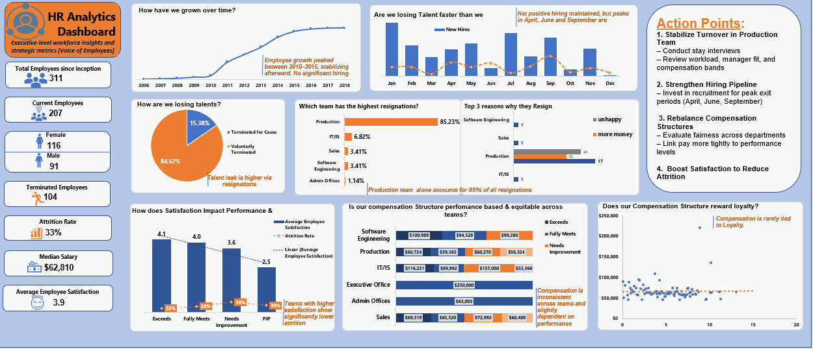

# HR Analytics – Listening to the Voice of Employees (VoE)

## Business Problem
Organizations often focus heavily on the Voice of the Customer (VoC) while overlooking the **Voice of the Employee (VoE)**—the internal force that directly shapes customer experience, productivity, and long-term business performance.  
Without data-driven insights into workforce growth, retention, satisfaction, and compensation equity, leadership decisions around people strategy risk being reactive rather than strategic.

## Objective
- Use employee data to assess workforce health and performance
- Identify retention risks, satisfaction drivers, and compensation gaps
- Build an executive-level HR dashboard to support fast, informed decision-making

**Key Focus Areas**
- Workforce growth and attrition trends  
- Employee satisfaction and performance relationship  
- Department-level retention challenges  
- Compensation equity across teams  
- Alignment between salary, tenure, and performance  

## Dataset
- **Source:** Simulated HR dataset (Analytics Extra Mentorship Programme – Week 1 Project)
- **Time Period:** Multi-year employee records
- **Key Fields:**
  - Employee ID
  - Department / Team
  - Hire date and exit date
  - Tenure
  - Performance rating
  - Satisfaction score
  - Salary and compensation details

## Tools Used
- Microsoft Excel  
  - Power Query  
  - Power Pivot  
  - PivotTables & PivotCharts  

## Analysis Approach

### Data Preparation
- Data cleaning and transformation using Power Query
- Creation of a relational data model in Power Pivot
- Integration of a calendar table for time-based analysis

### Exploratory & Diagnostic Analysis
- Workforce growth trends over time
- Hiring vs attrition patterns
- Department-level retention analysis
- Satisfaction and performance distribution

### Metrics & Calculations
- Attrition and retention rates
- Satisfaction vs performance analysis
- Compensation comparison across teams
- Salary vs tenure and performance relationships

### Visualization & Storytelling
- Executive-level Excel dashboard designed for HR and leadership stakeholders
- Interactive PivotCharts and slicers for dynamic exploration
- Clear storytelling flow focused on workforce health and risks

## Key Insights
- Employee turnover is **heavily concentrated in one department**, signaling targeted retention issues.
- **Employee satisfaction strongly influences performance and attrition**, highlighting its role as a leading indicator.
- **Compensation inconsistencies exist across teams**, raising equity and morale concerns.
- The **hiring pipeline weakens during peak exit months**, increasing workforce strain.

## Recommendations
- **HR & Leadership**
  - Implement targeted retention strategies for high-attrition departments.
- **People Managers**
  - Actively monitor and improve employee satisfaction to boost performance and reduce exits.
- **Compensation & Strategy Teams**
  - Review pay structures to address compensation inequities and align rewards with performance and tenure.
- **Talent Acquisition**
  - Strengthen hiring efforts ahead of historically high exit periods.

## Skills Demonstrated
- HR analytics and workforce data analysis
- Data modeling in Excel using Power Pivot relationships
- Creation of calculated fields and DAX measures
- Time-based analysis using calendar tables
- PivotTables and advanced PivotCharts
- Scatter chart creation from Pivot data
- Executive dashboard design and storytelling
- Translating business questions into actionable metrics

## Deliverables
- Executive level static HR Analytics Dashboard (Excel)
- Executive-ready insights and action points for leadership

